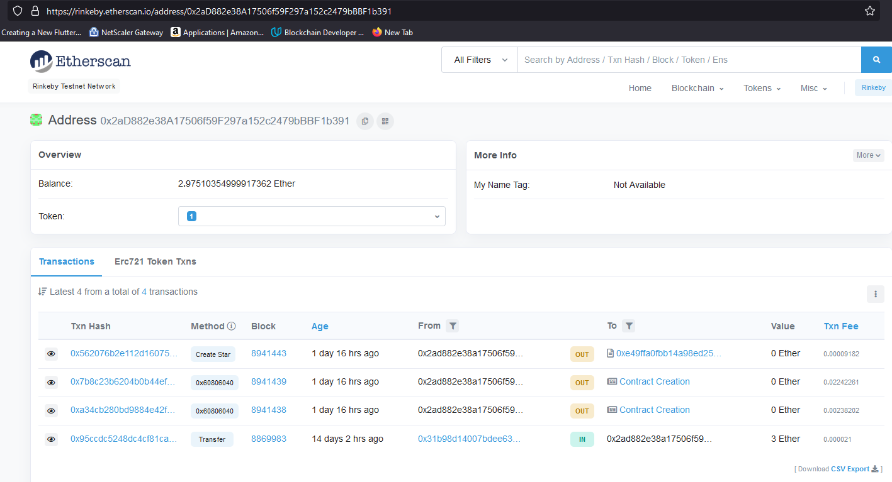
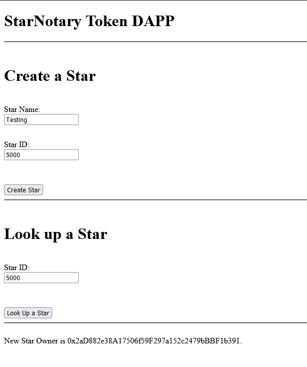

# ND1309 C2 Ethereum Smart Contracts, Tokens and Dapps - Project Star Notary 
**Decentralized Star Notary Service Project** 
https://rinkeby.etherscan.io/address/0x2aD882e38A17506f59F297a152c2479bBBF1b391



## Project Requirements

1. ERC-721 Token Name: **Star Notary Token By JPC**
2. ERC-721 Token Symbol: **JPC**
3. Versions: Truffle v5.0.2 and OpenZeppelin 2.3

## Smart Contract Functions
### StarNotary.sol ###
1. Function to create star
```
function createStar(string memory _name, uint256 _tokenId) public {}
```
2. Function to put a star up for sale
```
function putStarUpForSale(uint256 _tokenId, uint256 _price) public {}
```
3. Function to buy a star that is up for sale
```
function buyStar(uint256 _tokenId) public  payable {}
```
4. Function to look up a star info based on token id
```
function lookUptokenIdToStarInfo (uint _tokenId) public view returns (string memory) {}
```
5. Function to exchange stars
```
function exchangeStars(uint256 _tokenId1, uint256 _tokenId2) public {}
```
6. Function to transfer star ownership
```
function transferStar(address _to1, uint256 _tokenId) public {}
```

## DAPP GUI



## Contract Testing
### TestStarNotary.js ###


  √ can Create a Star (164ms)

  √ lets user1 put up their star for sale (230ms)

  √ lets user1 get the funds after the sale (292ms)

  √ lets user2 buy a star, if it is put up for sale (394ms)

  √ lets user2 buy a star and decreases its balance in ether (341ms)

  √ can add the star name and star symbol properly (98ms)

  √ lets 2 users exchange stars (380ms)

  √ lets a user transfer a star (269ms)
  
  √ lookUptokenIdToStarInfo test (143ms)

